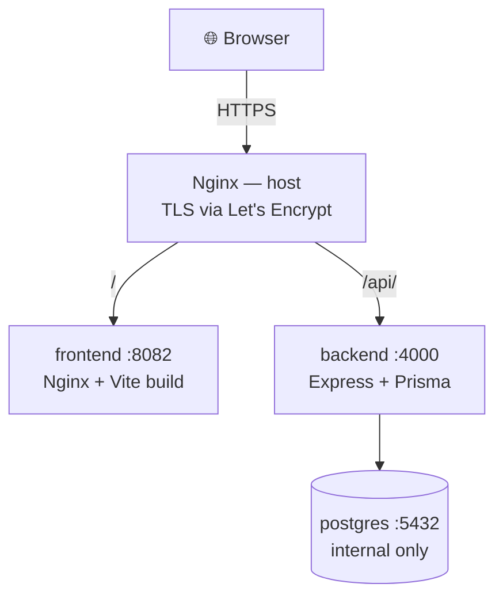

# Interactive Portfolio Room

An interactive developer portfolio built as an explorable 3D room — walk around a scene, interact with objects, and open project, skill, and contact panels. A recruiter mode offers the same content as a fast, linear page for people who want the proof of work without the game.

**Live:** <https://marcodiaz.me>


---

## Screenshots

| Room entry | Recruiter view |
| --- | --- |
|  |  |


---

## Features

- **3D room experience** — React Three Fiber scene with interactable objects that open project, skills, resume, and contact overlays.
- **Recruiter mode** — linear, scannable route (`/#/recruiter`) for fast evaluation.
- **Full-stack backend** — Express + Prisma + PostgreSQL API serving projects, skills, experiences, posts, goals, and trophies.
- **Admin dashboard** — JWT-authenticated CRUD for all portfolio content.
- **Contact flow** — validated form delivered through Resend, with graceful fallback.
- **Analytics** — visit tracking, device/country breakdowns, and dialogue interaction logs.
- **Auto devlog** — GitHub push webhook (HMAC-signed) generates a live activity feed.
- **Offline-tolerant frontend** — bundled fallback content keeps the site useful if the API is down.
- **CI/CD** — GitHub Actions builds images, pushes to GHCR, and the server only pulls and restarts.

---

## Stack

| Layer | Technology |
| --- | --- |
| Frontend | React, Vite, TypeScript, React Router, React Three Fiber, Drei, Zustand, Framer Motion |
| Backend | Node.js, Express, Prisma, PostgreSQL, Zod |
| Infrastructure | Docker, Docker Compose, Nginx, Let's Encrypt, GitHub Actions, GHCR |
| Testing | `node:test` (Node built-in runner) + `tsx` |

### Why this stack

**React + Vite + TypeScript** keep iteration fast while the room, overlays, and recruiter view stay strongly typed. The heaviest views are code-split with `React.lazy`/`Suspense` in [App.tsx](apps/frontend/src/App.tsx) so a visitor does not download the 3D scene, audio, and recruiter mode up front.

**Zustand** is the right size for the global state this app actually has — overlays, audio, tutorial visibility, interaction flags. A heavier store would add ceremony without improving anything.

**React Three Fiber + Drei** make the 3D room the differentiator while staying inside the React component model, so scene pieces can be lazily mounted like any other component.

**Express + Prisma + PostgreSQL** fit a genuinely relational domain (projects, skills, experiences, messages, visits, analytics) with predictable queries and real migrations.

**Docker + GitHub Actions + GHCR** solve a concrete constraint: the production host is a 1 GB VM. Building images on the server would exhaust its RAM and disk, so builds run in CI and the server only pulls ready-made images.

**Fallback-first data loading** — [`usePortfolioData`](apps/frontend/src/lib/usePortfolioData.ts) renders bundled content immediately and hydrates from the API when it responds, so a slow or down backend degrades quietly instead of showing an empty page.

---

## Architecture



The browser never talks to the backend port directly — all API traffic goes through `/api` on the same origin, which keeps CORS simple and avoids mixed-content issues. Postgres is not published to the host; only the backend reaches it over the Compose network.

Full breakdown — request pipeline, data model, frontend modules, and the reasoning behind each decision: [documentations/architecture.md](documentations/architecture.md).

### Repository layout

```text
.
├── apps
│   ├── backend          # Express + Prisma API
│   │   ├── prisma       # schema, migrations, seed
│   │   ├── src
│   │   └── test
│   └── frontend         # Vite + React client
│       ├── src
│       └── test
├── packages
│   └── shared           # Zod contracts shared by both apps
├── documentations       # public documentation
├── docs                 # internal notes and runbooks
├── docker-compose.yml       # local full stack
├── docker-compose.prod.yml  # production (GHCR images)
└── .github/workflows/deploy.yml
```

---

## Documentation

| Document | Covers |
| --- | --- |
| [architecture.md](documentations/architecture.md) | Topology, repository layout, backend layers, data model, frontend structure |
| [deployment.md](documentations/deployment.md) | CI/CD pipeline, images, Compose topology, configuration, rollback |
| [api.md](documentations/api.md) | Endpoint reference, response envelope, auth, rate limits, webhooks |
| [security.md](documentations/security.md) | Threat model, auth, validation, network exposure, known limitations |
| [operations.md](documentations/operations.md) | Commands, health checks, database ops, troubleshooting, incident response |

---

## Getting Started

### Prerequisites

- Node.js `>= 20.11.0`
- npm `>= 10.2.0`
- PostgreSQL (or Docker)

### Setup

```bash
git clone https://github.com/eldmark/game-portafolio.git
cd game-portafolio
npm install

cp apps/backend/.env.example apps/backend/.env
cp apps/frontend/.env.example apps/frontend/.env

npm run db:bootstrap   # migrate + seed
npm run dev
```

- Frontend: <http://localhost:3000>
- API: <http://localhost:4000>

> The seed script is destructive — it wipes existing records before recreating them. Use it on development databases only.

### Environment variables

**`apps/backend/.env`**

| Variable | Purpose |
| --- | --- |
| `DATABASE_URL` | PostgreSQL connection string |
| `JWT_SECRET` | Signing secret for admin tokens (HS256) |
| `CORS_ORIGIN` | Comma-separated allowlist of browser origins |
| `RESEND_API_KEY` | Contact form delivery |
| `CONTACT_EMAIL` | Destination inbox |
| `GITHUB_WEBHOOK_SECRET` | HMAC secret for the devlog webhook |

**`apps/frontend/.env`**

| Variable | Purpose |
| --- | --- |
| `VITE_API_URL` | `http://localhost:4000` locally, `/api` in production |

> In production `VITE_API_URL` must be `/api`. Baking a host and port into the bundle bypasses the reverse proxy and reintroduces CORS problems.

### Docker (local)

```bash
npm run docker:up     # full stack
npm run docker:down
```

### Routes

`HashRouter` keeps URLs hash-based, so the app stays portable across hosts that do not guarantee SPA rewrite rules: `/#/`, `/#/recruiter`, `/#/admin/login`.

---

## API

Successful responses are `{ "data": ... }`; errors are `{ "error": "message" }`.

Public endpoints cover projects, skills, experiences, posts, goals, trophies, the devlog feed, and aggregate analytics. Writes cover the contact form and session telemetry. Everything under `/admin` requires a bearer token, and `/webhooks/github` requires an HMAC signature.

Full endpoint reference with request and response shapes: [documentations/api.md](documentations/api.md).

---

## Security

The admin surface is scoped to a **single administrator** — the portfolio owner. Every authenticated user shares the same privilege level by design: there are no roles or permission tiers. That is a deliberate trade-off for a personal site and **not** an enterprise IAM design. Do not reuse this auth layer for multi-tenant or multi-role applications.

Headline controls: bcrypt password hashing, HS256 JWTs with a pinned algorithm and 1-hour expiry, per-route rate limiting, Zod validation on every request body, `helmet` headers with an explicit CORS allowlist, an unpublished database, and constant-time HMAC verification on the webhook.

Threat model, control details, and known limitations: [documentations/security.md](documentations/security.md).

---

## Testing

The suite runs on the Node.js built-in test runner with `tsx` for TypeScript — no extra framework to install.

```bash
npm test                                       # everything
npm run test --workspace @portfolio/backend
npm run test --workspace @portfolio/frontend
```

**Backend** — error-handler mapping, JWT sign/verify and tamper cases, bearer-token middleware, GitHub webhook signature verification, devlog message generation, record-to-DTO mapping, analytics aggregation, and the shared Zod contracts guarding every API boundary.

**Frontend** — battle store state machine (phases, PP consumption, damage, win/loss, reset) and room object selection (nearest interactable, range limits, per-object distance).

Tests target pure logic: services, middleware, stores, and schemas. Rendering and 3D scene code is not unit tested — covering it would require a DOM environment and a WebGL mock for very little signal.

### Quality commands

```bash
npm test
npm run typecheck
npm run lint
npm run format
```

---

## Deployment

Production runs on a 1 GB VM behind Nginx with Let's Encrypt TLS. Images are **built in CI, never on the server** — a build on the host would exhaust its RAM and disk.

Push to `main` → GitHub Actions builds both images → pushes them to GHCR → the server pulls and recreates containers via [docker-compose.prod.yml](docker-compose.prod.yml).

Pipeline details, required secrets, and rollback: [documentations/deployment.md](documentations/deployment.md). Day-two operations and troubleshooting: [documentations/operations.md](documentations/operations.md).

---

## A Note on Project Sources

This portfolio mixes public personal and academic projects — linked to their repositories — with professional client work whose source cannot be published because it belongs to a company or falls under an NDA.

For private work, the portfolio still exposes what matters for evaluation: architecture summary, stack decisions, technical challenges, deployment notes, and demo media where available. The goal is to be explicit about code ownership boundaries rather than present confidential work as public.

---

## Roadmap

- Richer case studies and demo captures per project
- Dark mode that preserves the current visual identity
- Production seeding without a manual `tsx` install
- Timeout handling around outbound Resend requests

---

## License

[MIT](LICENSE) © Marco Alejandro Díaz Castañeda

---

## Contact

**Marco Alejandro Díaz Castañeda** — Full-Stack Developer

[Portfolio](https://marcodiaz.me) · [GitHub](https://github.com/eldmark)
