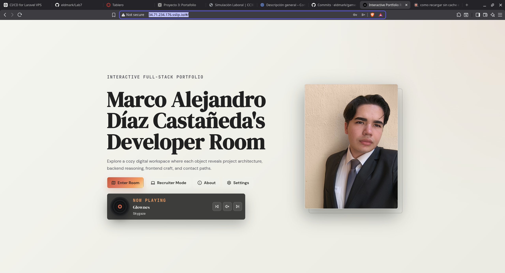
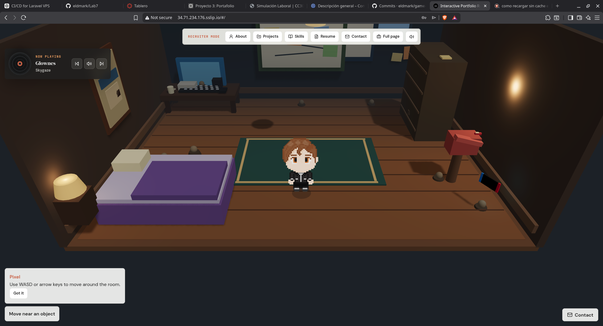
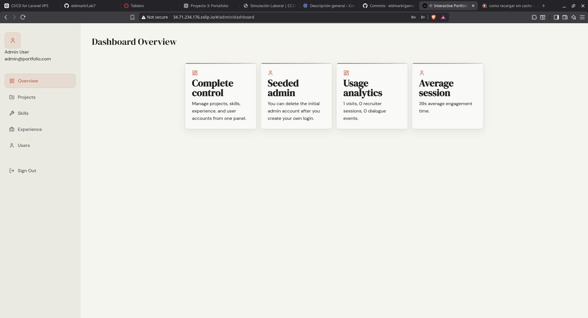

# Interactive Portfolio Room

Interactive portfolio presented as an explorable 3D room with a recruiter-friendly alternate view, admin dashboard, analytics, contact flow, and a small full-stack backend. production https://marcodiaz.me/

This repository is a monorepo with:

- `apps/frontend`: Vite + React portfolio client
- `apps/backend`: Express + Prisma + PostgreSQL API
- `packages/shared`: shared contracts and schemas

## What This Project Does

The project exposes two primary user experiences:

- A room-based portfolio where visitors move around a scene, interact with objects, and open overlays for projects, skills, contact, and resume content.
- A recruiter page with a faster linear navigation flow for proof-of-work review.

It also includes:

- Admin authentication and dashboard routes
- Contact form delivery with Resend and fallback behavior
- Visit tracking and dialogue analytics
- Dockerized deployment for frontend, backend, and PostgreSQL

## Stack

- Frontend: React, Vite, TypeScript, React Router, React Three Fiber, Drei, Zustand, Framer Motion
- Backend: Node.js, Express, Prisma, PostgreSQL, Zod
- Infrastructure: Docker, Docker Compose, Nginx, GitHub Actions, GHCR

## Why This Stack Was Chosen

This stack is a good fit for this portfolio because it balances presentation, maintainability, and operational reality without overcomplicating the codebase. On the frontend, `React + Vite + TypeScript` give a fast iteration loop while still keeping the room experience and recruiter view strongly typed, and the code makes that decision concrete by using `React.lazy` and `Suspense` in [apps/frontend/src/App.tsx](apps/frontend/src/App.tsx) to split the heaviest views into separate chunks instead of loading everything at startup. That matters here because the portfolio includes a 3D scene, animated overlays, audio, and a recruiter mode, so the app benefits from deferring non-critical code until it is actually needed. The same logic applies to the data layer: `usePortfolioData` in [apps/frontend/src/lib/usePortfolioData.ts](apps/frontend/src/lib/usePortfolioData.ts) hydrates live backend data asynchronously but keeps fallback content ready immediately, which means the page stays useful even if the API is slow or unavailable. `React Router` and `HashRouter` are also a practical choice because this project is deployed behind a reverse proxy and should keep stable recruiter and admin routes without depending on server rewrite rules. For state, `Zustand` is the right amount of abstraction because the app only needs lightweight global UI state such as overlays, audio, tutorial visibility, and room interaction flags; using a heavier store pattern would add complexity without improving the user experience. `React Three Fiber + Drei` are justified because they let the portfolio use a 3D room as a differentiator while still staying inside the React component model, and the room can lazily load expensive pieces instead of blocking the rest of the interface. `Framer Motion` adds controlled transitions that make overlays feel intentional rather than bolted on, which helps the product feel polished without introducing expensive rendering logic. On the backend, `Express + Prisma + PostgreSQL` are a strong combination because the API is explicit, the database is relational, and the schema is expressive enough to support projects, skills, experiences, messages, visits, and dialogue analytics with predictable queries and migrations; that is a better fit than a more abstract stack because the portfolio needs to demonstrate real engineering judgment, not just framework usage. Finally, `Docker + Docker Compose` and `GitHub Actions + GHCR` are not cosmetic choices: they solve a real production constraint by moving image builds off the server, reducing CPU, RAM, and disk pressure during deployment, which is especially important for a low-resource host and makes the infrastructure easier to reason about, reproduce, and explain in an interview.

## Project Proof And Repository Notes

This portfolio intentionally includes a mix of:

- Public personal or academic projects with repository links when they can be shared.
- Professional client work where the implementation can be described, but the source repository cannot be published because the code belongs to a company or is protected by NDA/internal ownership rules.

For those private projects, the portfolio still exposes the engineering signal that matters for evaluation:

- architecture summary
- stack decisions
- technical challenges
- deployment and infrastructure notes
- demo media when available

The goal is to be honest about code ownership boundaries without presenting confidential work as public.

## Screenshots / GIFs

Current interface captures stored in the repository:





Additional project demos are also embedded in the app through local media assets under `apps/frontend/public/assets/demos`.

## Repository Layout

```text
.
├── apps
│   ├── backend
│   │   ├── src
│   │   └── test
│   └── frontend
│       ├── src
│       └── test
├── packages
│   └── shared
├── docker-compose.prod.yml
└── .github/workflows/deploy.yml
```

## Routing Model

The frontend uses `HashRouter`.

That matters for production URLs:

- Public home: `http://<host>/#/`
- Recruiter page: `http://<host>/#/recruiter`
- Recruiter section example: `http://<host>/#/recruiter/projects`
- Admin login: `http://<host>/#/admin/login`
- Admin dashboard: `http://<host>/#/admin/dashboard`

This was chosen because the project may be hosted behind simple static hosting or nested paths where server-side SPA rewrites are not guaranteed.

## API Model

The frontend should call the backend through `/api` in production.

That means:

- Browser -> `http://<host>/api/...`
- Nginx -> proxies `/api` to the backend container

Do not build production frontend images with `VITE_API_URL=<server-ip>:4000`. That bypasses the reverse proxy, creates CORS issues, and breaks browser behavior.

Correct production value:

```env
VITE_API_URL=/api
```

## Local Development

### Prerequisites

- Node.js `>= 20.11.0`
- npm `>= 10.2.0`
- PostgreSQL if running outside Docker

### Environment Files

Create local env files as needed:

```bash
cp .env.example .env
cp apps/backend/.env.example apps/backend/.env
cp apps/frontend/.env.example apps/frontend/.env
```

Important local variables:

- `apps/backend/.env`
  - `DATABASE_URL`
  - `JWT_SECRET`
  - `CORS_ORIGIN`
  - `RESEND_API_KEY`
  - `CONTACT_EMAIL`
- `apps/frontend/.env`
  - `VITE_API_URL`

### Install

```bash
npm install
```

### Database

Apply migrations:

```bash
npm run db:migrate
```

Seed data:

```bash
npm run db:seed
```

Bootstrap from scratch:

```bash
npm run db:bootstrap
```

### Run Locally

```bash
npm run dev
```

Expected local URLs:

- Frontend dev server: `http://localhost:3000`
- Backend API: `http://localhost:4000`

## Docker

For local full-stack execution:

```bash
npm run docker:up
```

Stop containers:

```bash
npm run docker:down
```

## Production Deployment

The production stack is designed for low-memory servers and expects images to be built in GitHub Actions, not on the server.

### Production Flow

1. Push to `main`
2. GitHub Actions builds frontend and backend images
3. Images are pushed to GHCR
4. The server pulls the images and recreates containers
5. Nginx serves the frontend and proxies `/api` to the backend

This deployment design was chosen intentionally because the server is resource-constrained. Building frontend and backend container images directly on the machine would add avoidable CPU, RAM, and disk pressure. By pushing the build step into GitHub Actions and publishing images to GHCR first, the server only needs to pull ready-made images and restart containers.

### Production Compose File

- [docker-compose.prod.yml](docker-compose.prod.yml)

Current production port mapping in that file:

- Frontend container -> host `8082`
- Backend container -> host `4000`
- Postgres container -> host `5432`

Nginx should proxy:

- `/` -> `http://127.0.0.1:8082`
- `/api/` -> `http://127.0.0.1:4000/`

### GitHub Actions Secrets

Required secrets for the current deploy flow:

- `SERVER_HOST`
- `SERVER_USER`
- `SSH_PRIVATE_KEY`
- `POSTGRES_PASSWORD`
- `JWT_SECRET`
- `CORS_ORIGIN`
- `RESEND_API_KEY`
- `CONTACT_EMAIL`
- `VITE_API_URL`

Recommended values in the current `sslip.io` single-host setup:

```env
CORS_ORIGIN=http://34.71.234.176.sslip.io,http://portfolio.34.71.234.176.sslip.io
VITE_API_URL=/api
```

Important: `CORS_ORIGIN` must contain the browser origin exactly, without the `/api` path. If the public site is opened at `http://34.71.234.176.sslip.io`, that exact origin must be present in the allowed list.

### Current `sslip.io` Pattern

Current public hostname shape:

```text
http://34.71.234.176.sslip.io
```

For practical consistency, prefer one public hostname and use that same hostname in `CORS_ORIGIN`.

## API Reference

All successful responses use:

```json
{ "data": ... }
```

Errors use:

```json
{ "error": "message" }
```

### Public Endpoints

- `GET /projects`
- `GET /projects/:slug`
- `GET /skills`
- `GET /experiences`
- `POST /messages`
- `POST /visits`
- `PATCH /visits/:sessionId`
- `POST /dialogue-logs`
- `GET /analytics/summary`
- `GET /analytics/timeseries?days=30` — visits over time + device/country breakdowns (max 90 days)
- `GET /goals`
- `GET /trophies`
- `GET /posts`
- `GET /posts/:slug`
- `GET /devlog?limit=20` — auto-generated GitHub activity feed (max 50)

### Auth

- `POST /auth/login`

### Webhooks

- `POST /webhooks/github` — GitHub push webhook (HMAC-SHA256 signed with
  `GITHUB_WEBHOOK_SECRET`); creates devlog entries for pushes to
  `main`/`master`

### Admin

Requires `Authorization: Bearer <token>`.

**Scope:** the admin panel is designed for a **single administrator** — the portfolio
owner. Every authenticated user shares the same privilege level by design; there are
no roles, permission tiers, or delegated access, so any account that can log in can
also create and delete other accounts. This is a deliberate trade-off for a personal
portfolio and is **not** an enterprise IAM system. Do not reuse this auth layer for
multi-tenant or multi-role applications.

Security controls on this surface: passwords hashed with bcrypt (cost 10, 12-character
minimum), JWT access tokens that expire after 1 hour with the signing algorithm pinned
to HS256, rate limiting of 5 login attempts per IP per 15 minutes, Zod validation on
every request body, an explicit CORS allowlist, and `helmet` security headers.

Known limitation: the token is held in `localStorage` rather than an `HttpOnly` cookie,
so it is readable by JavaScript on the origin. The short expiry limits the window; a
cookie-based session would close it fully at the cost of reintroducing CSRF handling.

- `GET /admin/users`
- `POST /admin/users`
- `DELETE /admin/users/:id`
- `POST /admin/projects`
- `PATCH /admin/projects/:id`
- `DELETE /admin/projects/:id`
- `POST /admin/skills`
- `PATCH /admin/skills/:id`
- `DELETE /admin/skills/:id`
- `POST /admin/experiences`
- `PATCH /admin/experiences/:id`
- `DELETE /admin/experiences/:id`
- `POST /admin/goals`
- `PATCH /admin/goals/:id`
- `DELETE /admin/goals/:id`
- `POST /admin/trophies`
- `PATCH /admin/trophies/:id`
- `DELETE /admin/trophies/:id`
- `POST /admin/posts`
- `PATCH /admin/posts/:id`
- `DELETE /admin/posts/:id`
- `DELETE /admin/devlog/:id`

## Admin Access

Production admin URLs:

- Login: `http://<host>/#/admin/login`
- Dashboard: `http://<host>/#/admin/dashboard`

Do not use `/admin/login` without `#/` unless the router strategy changes.

## Seeding Notes

The backend seed command is currently:

```bash
npm run db:seed --workspace @portfolio/backend
```

In development this works because `tsx` is available.

In the current production container, dev dependencies are pruned, so `tsx` is not available by default. If you need to seed the running production container immediately, the temporary workaround is:

```bash
docker exec -it portfolio-backend sh -lc "npm install --no-save tsx && npm run db:seed --workspace @portfolio/backend"
```

Important caveat:

- The seed script is destructive. It deletes existing users, projects, skills, experiences, messages, visits, and dialogue logs before recreating the seeded records.

This is a temporary operational workaround, not the ideal long-term production seeding strategy.

## Operational Checks

Useful server-side checks:

```bash
docker compose -f docker-compose.prod.yml ps
docker compose -f docker-compose.prod.yml logs -f
docker stats
free -h
df -h
```

Useful API checks:

```bash
curl http://127.0.0.1:4000/projects
curl http://127.0.0.1:4000/messages -X POST \
  -H "Content-Type: application/json" \
  -d '{"name":"test","email":"test@example.com","message":"hello from server"}'
curl http://34.71.234.176.sslip.io/api/projects
```

Useful frontend verification:

- Confirm the deployed frontend bundle does not contain `34.71.234.176:4000`
- Confirm it uses `/api`
- Confirm recruiter routes are under `/#/recruiter/...`

## Known Production Lessons

These issues already occurred during deployment and are worth documenting explicitly:

- If Nginx points to the wrong frontend port, the public site may return `502 Bad Gateway`.
- If `VITE_API_URL` is built as `34.71.234.176:4000`, the browser may bypass the proxy and create CORS and timeout issues.
- If `CORS_ORIGIN` changes in `.env`, the backend container must be recreated to pick up the new value.
- If the browser still behaves like an old version after deploy, force a hard refresh or test in a private window because stale JS assets can hide server-side fixes.
- The server currently has low disk headroom. Monitor `df -h` before large image pulls or repeated redeploys.

## Challenges Encountered

- The production server has limited resources, so building images on-host was an unnecessary risk for RAM and disk usage.
- To avoid overloading the server, the deployment flow was adjusted so GitHub Actions builds the frontend and backend containers, pushes them to GHCR, and the server only pulls and recreates containers.
- The frontend had to be aligned with a reverse-proxy `/api` setup to avoid CORS issues and direct-browser calls to the backend port.
- Because the application uses `HashRouter`, deployment and documentation had to stay consistent with `/#/`-based routes for recruiter and admin flows.
- The portfolio had to remain useful even when the API is unavailable, so the frontend uses fallback content while still demonstrating real async data fetching when the backend is up.

## Future Improvements

- Add more projects with richer case-study detail and more polished engineering writeups.
- Add more demos and media captures for each project so the portfolio communicates implementation quality faster.
- Add a dark mode without weakening the current visual identity of the room and recruiter views.

## Tests

The suite runs on the Node.js built-in test runner (`node:test`) with `tsx` for
TypeScript, so there is no extra test framework to install or configure.

Run everything from the repository root:

```bash
npm test
```

That builds `@portfolio/shared` first (the backend tests import its compiled
schemas), then runs the backend and frontend suites. Individual workspaces:

```bash
npm run test --workspace @portfolio/backend
npm run test --workspace @portfolio/frontend
```

### What Is Covered

`apps/backend/test`

- `errors.test.ts` — error handler mapping for `HttpError`, Zod validation failures, and rejected promises in `asyncHandler`
- `auth.test.ts` — JWT sign/verify round-trip, tampered tokens, tokens signed with a foreign secret
- `auth-middleware.test.ts` — bearer parsing, missing/malformed headers, invalid tokens
- `github-webhook-middleware.test.ts` — HMAC-SHA256 signature verification, wrong secret, tampered body, missing signature, unconfigured secret
- `devlog-phrases.test.ts` — devlog message generation for single and multi-commit pushes
- `goals-trophies-service.test.ts` — record-to-DTO mapping, date serialization, unknown status fallback
- `portfolio-service.test.ts` — analytics summary aggregation
- `shared-schemas.test.ts` — the `@portfolio/shared` Zod contracts that guard every API boundary

`apps/frontend/test`

- `battle-store.test.ts` — battle phase transitions, PP consumption, damage application, win/loss resolution, reset
- `room-objects.test.ts` — nearest-interactable selection, range limits, per-object interaction distance

Tests target pure logic — services, middleware, stores, and schemas. Rendering
and 3D scene code is not unit tested, because covering it would mean pulling in
a DOM environment and a WebGL mock for very little signal.

## Quality Commands

```bash
npm test
npm run typecheck
npm run lint
npm run format
```

If local `node` tooling is unavailable in the shell you are using, `bunx tsc` can still be used for direct TypeScript verification.

## Current Status Summary

At the time of this README update, the project has been adapted to:

- serve the frontend through `HashRouter`
- work behind a reverse-proxied `/api` path
- support `sslip.io`-based server access
- expose admin routes through hash-based URLs
- tolerate browsers where `crypto.randomUUID()` is unavailable
- avoid room keyboard crashes while typing inside the mailbox form

The remaining long-term operational improvements are:

- make production seeding work without installing `tsx` manually
- reduce disk pressure on the server
- add timeout handling around Resend requests in the backend
